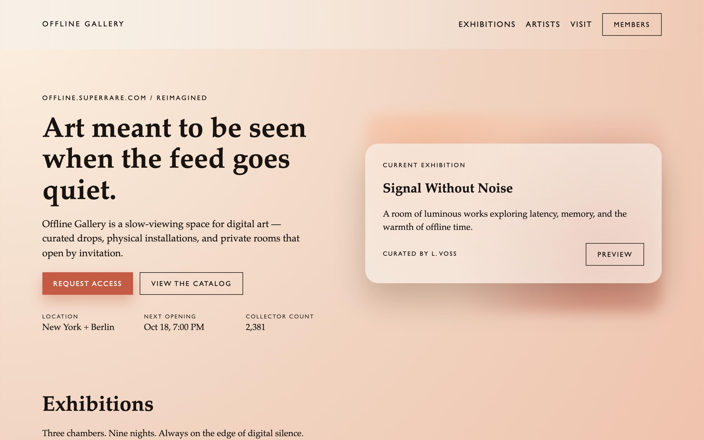

# Offline Gallery

A speculative landing page for a slow-viewing space for digital art. Art meant to be seen when the feed goes quiet.

**View it:** [calbotsman.github.io/offline-gallery](https://calbotsman.github.io/offline-gallery/)

## What it is

A concept piece, not a product. It reimagines a gallery's offline programme as something closer to a members' room: curated drops, physical installations, private rooms that open by invitation. Exhibitions, artists in residence, a visit section, a request-access flow. All of the copy, names and numbers on the page are invented for the exercise.

Static HTML, CSS and a few lines of JavaScript. No dependencies, no build step.

## Why it exists

A riff on a real gallery's offline programme, redrawn as a members' room rather than a shop.

## Running it

Open `index.html`.
